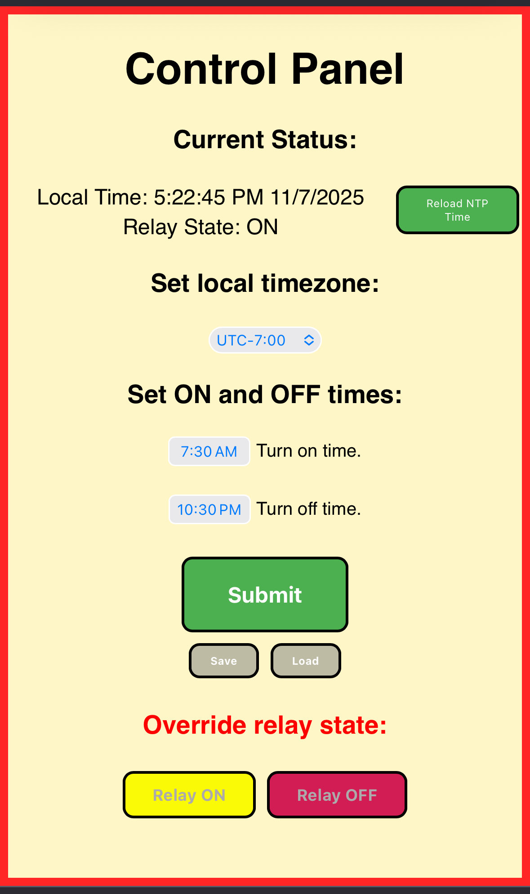

# Dumb-Smart-Outlet-Timer
A DIY outlet timer for a Raspberry Pi Pico W, written in MicroPython.

## Disclaimers
I am not an electrical engineer [assembly instructions](#assembly) are not intended to be a strict step-by-step tutorial, it is just a what I did.

No generative AI was used in the creation of this code or device, support real human work.

## Introduction
The Dumb Smart Outlet Timer is an outlet timer that is controlled with a Raspberry Pi Pico W. This is intended to be a cheap WiFi controlled timer that does not interface with a smart-home or require a propietary app to function (hence the dumb-smart). However it is configured via [http string queries](#http-string-queries) so it would be pretty easy to make it work with an app or smart-home setup. 

## Configuration
The outlet timer can be configured by typing in the Pico's IP address in the URL bar on your browser (designed to fit on a phone screen). 
- Reload NTP Time:
    - Syncs system time with NTP server.
- Set local timezone:
    - Sets the local timezone relative to UTC +0:00 (Universal time)
- Set On and Off times:
    - Sets the local time that the relay will turn off and turn on
- Submit:
    - Applies current settings to Pico timer
- Save:
    - Saves current settings to Pico's internal persistant storage
- Load:
    - Loads saved settings 
    - note: does not apply them automatically, hit submit after to apply.
- Override relay states:
    - Overrides current on/off state 
    - Does not stop timer, timer will continue its programmed schedule 

## HTTP String Queries
The outlet timer can also be configured by sending an http string query to the Pico, so it can be set up to be configured by an external source, such as a custom smart home installation. However loading settings relies on recieving a response with the loaded data to then apply, so it may take extra configurating to make that part work.

### Main config queries 
The main config queries should be chained together with submit at the end. 

Example: `0.0.0.0/?timezone=-7&turnon_time=07%3A30&turnoff_time=22%3A30&submit=submit `

or `0.0.0.0/?submit=load` if loading data

- timezone:
    - sets local timezone of Pico
    - integers in range from -12 to 14 are valid inputs
- turnon_time:
    - sets the time that the relay will switch on
    - expects time to be in 24hr format with hh%3Amm
    - Example: 20%3A45 is 8:45 PM
- turnoff_time:
    - sets the time that the relay will switch off
    - same as on time, expects time to be in 24hr format with hh%3Amm
- submit:
    - tells server what to do with entered settings
    - submit=save will apply and save the settings to file on Pico's persistant storage
    - submit=submit will just apply settings
    - submit=load will load the saved data and return it in response to client
        - note: known issue, if you submit a long query as a load such as `0.0.0.0/?timezone=-7&turnon_time=08%3A00&turnoff_time=20%3A00&submit=load` some unexpected behavior may arrise

### Other queries
Other queries should be used independently.

Example: `0.0.0.0/?relay=on`

or: `reload=true`

- relay:
    - overrides relay state (does not stop timer, timer will continue its programmed schedule)
    - valid options are relay=on or relay=off
- reload=true:
    - syncs system time with NTP server.
    - reload=false does nothing

## Required Parts
- Raspberry Pi Pico W (Flashed with MicroPython version 1.26.1)
- A 3v relay that can switch 120v
- (2) colored LEDs
- (2) 220 - 500 ohm resistors
- A fuze and fuze holder (use one that is the same or less amperage than your relay can handle)
- Old power surge protector (doesn't have to work, but make sure it is big enough to fit all parts inside)
- Sacraficial 5volt charger
- A few feet of medium guage wire
    - make sure it is the correct guage, rated for at least the same amperage as the fuze and relay
    - idealy in black, white, and green for North American standard
- Smaller guage wire
- Solder
- Heat shrink
- Soldering Iron

## Setup 
1. Flash Raspberry Pi Pico W with [MicroPython version 1.26.1](https://micropython.org/download/RPI_PICO_W/), follow the guide on MicroPython website.
2. Using your IDE of choice ([Thonny](https://thonny.org/) is a great beginner friendly option), open main.py and enter your WiFi credentials in the correct spots at the top of the file.
3. Save file to Raspberry Pi Pico W's internal storage, also open and save index.html and error.html
4. Run it from IDE to make sure it connects to your WiFi and get it's IP.
5. (Optional) Configure your router settings to set the Pico's new IP to be static. This will allow the Pico to retain the same ip indefinetly.

## Assembly

## Error Codes
The error LED will flash a set number of times, then pause for 2 seconds, then repeat if there is a problem during bootup.

|            LED Flash          |               Problem               |                      Solution                     |
| ----------------------------- | ----------------------------------- | ------------------------------------------------- |
| 4 flashes, repeat indefinetly |      Failed to connect to WiFi      |      Varify WiFi SSID and password and reboot     |
| 3 flashes, repeat indefinetly |    Failed to open socket server     |                  Reboot device                    |
|   2 flashes, repeat 2 times   | Failed to sync time with NTP server | Connect to Pico and send reload=true string query |
